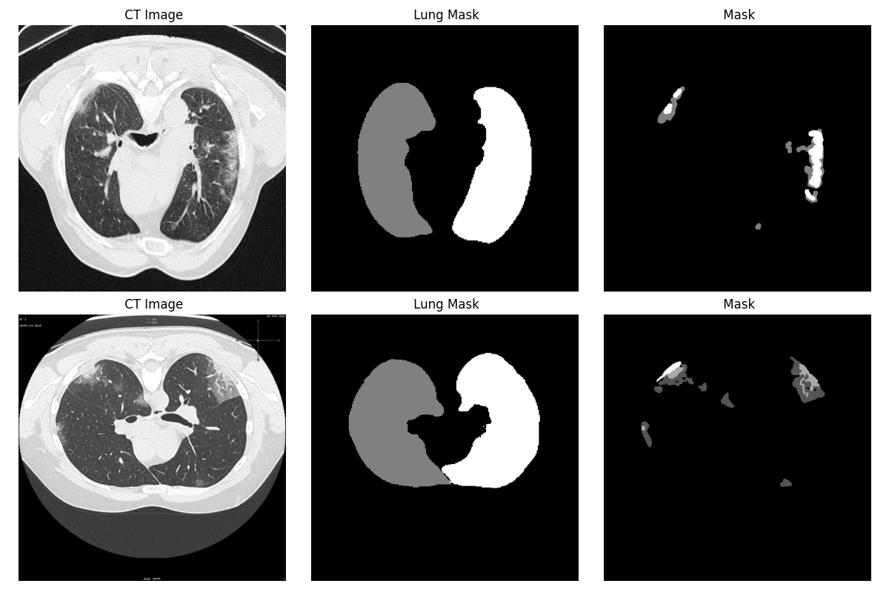

# PDAtt-Unet: COVID-19 CT Segmentation

This repository contains the official implementation of **PDAtt-Unet**, an advanced deep learning architecture for accurately segmenting lung and infection regions from COVID-19 CT scans. 

## 📌 Architecture
PDAtt-Unet builds upon the standard U-Net architecture but is enhanced with:
- **Attention Gates**: Specifically focuses on opaque infection regions while suppressing irrelevant background noise.
- **Dual-Decoder**: Jointly learns the structure of the lung lobes and the infection regions.
- **Hybrid Edge Loss**: A specialized loss function that penalizes inaccurate boundaries, allowing for highly precise delineation of complex COVID-19 lesions.

## 📊 Datasets
The model has been robustly evaluated across three independent public datasets to ensure clinical viability.

| Tên trong bài | Tên dataset gốc | Số lượng trong bài | Link tải / trang dataset |
| :--- | :--- | :--- | :--- |
| **Dataset_1** | COVID-19 CT segmentation dataset | 40 CT scans / 100 slices | [MedSeg](http://medicalsegmentation.com/covid19/) |
| **Dataset_2** | Segmentation dataset nr. 2 | 9 CT volumes / 829 slices | [MedSeg / Figshare](http://medicalsegmentation.com/covid19/) |
| **Dataset_3** | COVID-19-CT-Seg dataset / COVID-19 CT Lung and Infection Segmentation Dataset | 20 CT scans / 3520 slices | [Zenodo](https://zenodo.org/record/3757476#.Xpq9hsgzaUk) |

## 🖼️ Qualitative Results
We provide visual comparisons to demonstrate the effectiveness of PDAtt-Unet in segmenting ground-glass opacities and solid consolidations.

### 1. Cross-Dataset Evaluation
This scenario demonstrates the model's powerful generalization ability on unseen datasets. The overlay shows ground truth (Red) and prediction (Blue) overlapping to form Purple.


### 2. General Segmentation Quality
Our model maintains a strict adherence to infection boundaries.


### 3. Sample Architecture Output


## 🚀 How to Run
All training and testing scripts are located in the `detailed train and test` folder. We provide complete scripts for both within-dataset and cross-dataset testing.

```bash
# Example: Evaluate Model trained on Dataset 3 against Dataset 1
python "detailed train and test/test_D3model_on_D1.py"
```